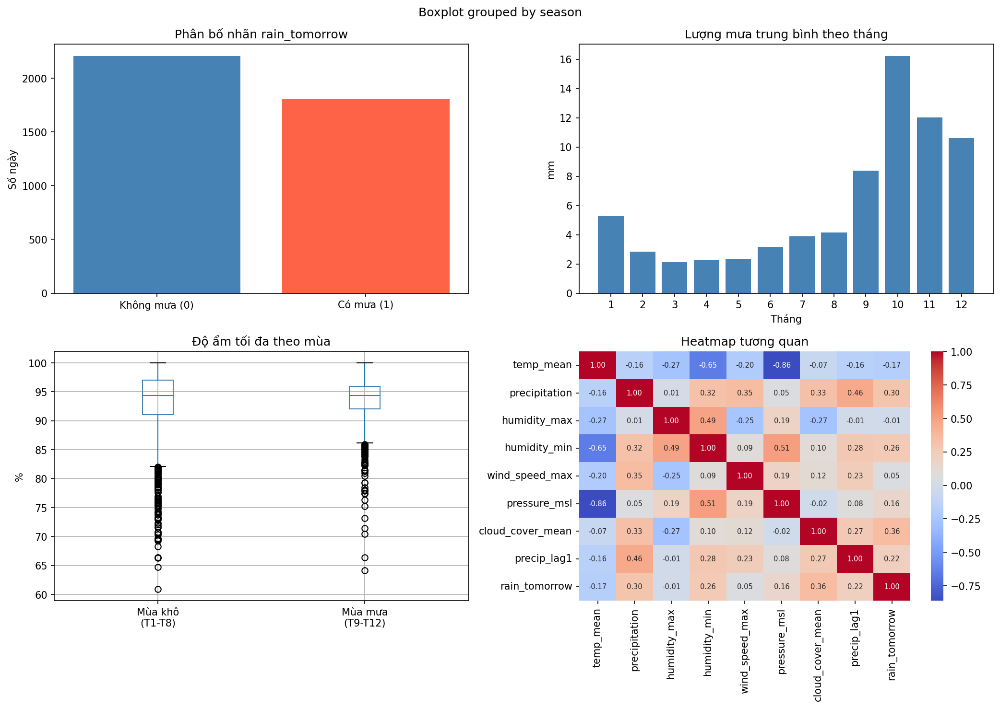
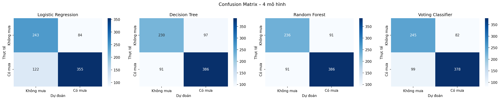
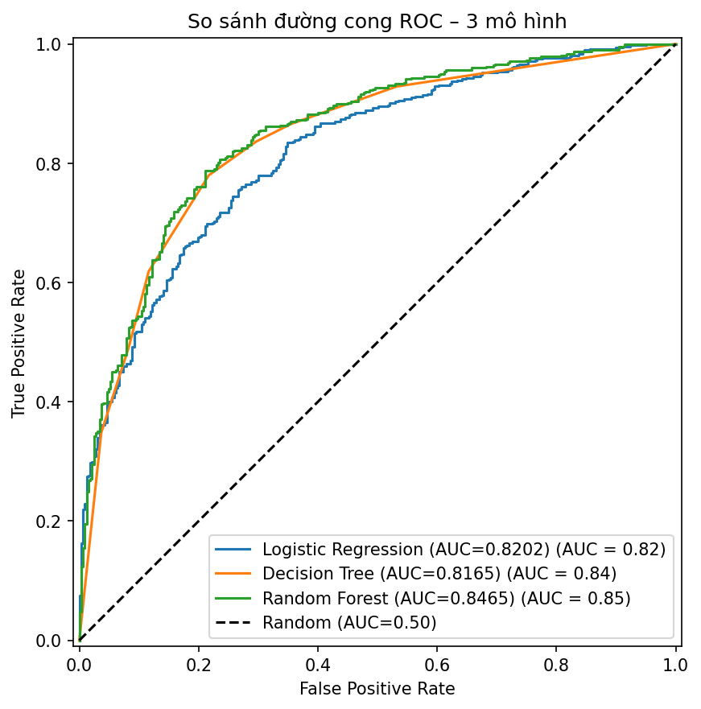
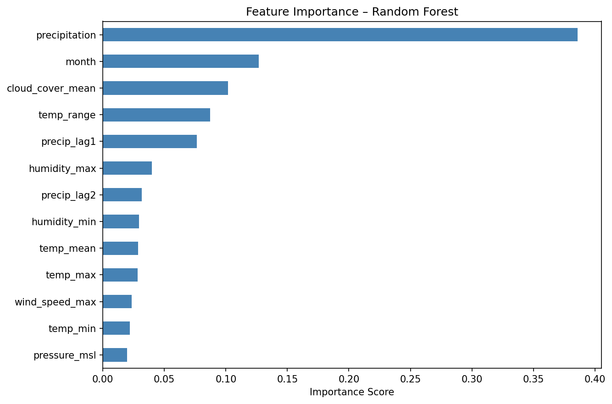

# 🌧️ Dự Báo Mưa Tại Đà Nẵng Sử Dụng Machine Learning

> Đồ án môn Học máy (1) — Đại học Công nghệ Thông tin và Truyền thông Việt–Hàn

---

## 📌 Giới thiệu

Dự án xây dựng mô hình học máy dự đoán **ngày mai có mưa hay không** tại thành phố Đà Nẵng (bài toán phân lớp nhị phân). Dữ liệu khí tượng 11 năm (2015–2025) được thu thập từ Open-Meteo API.

---

## 📊 Kết quả

| Mô hình | Accuracy | F1-Score | ROC-AUC |
|---|---|---|---|
| Logistic Regression | 0.7438 | 0.7751 | 0.8202 |
| Decision Tree | 0.7662 | 0.8042 | 0.8165 |
| **Random Forest** | **0.7736** | **0.8092** | **0.8465** |
| Voting Classifier | 0.7749 | 0.8068 | 0.8447 |

➡️ **Random Forest** đạt ROC-AUC cao nhất (0.8465) — mô hình tốt nhất tổng thể.

---
```text
## 🗂️ Cấu trúc dự án
rain-prediction-danang/
│
├── data/
│   ├── danang_weather_raw.csv         # Dữ liệu thô từ Open-Meteo
│   └── danang_weather_processed.csv   # Dữ liệu sau tiền xử lý
│
├── figures/
│   ├── eda_charts.png                 # Biểu đồ phân tích dữ liệu
│   ├── confusion_matrix.png           # Confusion Matrix 4 mô hình
│   ├── roc_curve.png                  # Đường cong ROC
│   └── feature_importance.png        # Feature Importance
│
├── models/
│   ├── random_forest.pkl              # Mô hình Random Forest đã train
│   ├── voting_classifier.pkl          # Mô hình Voting Classifier đã train
│   └── scaler.pkl                     # StandardScaler đã fit
│
├── src/
│   ├── collect_data.py                # Thu thập dữ liệu từ Open-Meteo API
│   ├── preprocess.py                  # Tiền xử lý và feature engineering
│   └── train.py                       # Huấn luyện và đánh giá 4 mô hình
│
├── notebooks/                         # Notebook thử nghiệm trên Colab
├── requirements.txt                   # Danh sách thư viện
└── README.md

---
```
## 🔧 Cài đặt và chạy

**1. Clone repo**
```bash
git clone https://github.com/YOUR_USERNAME/rain-prediction-danang.git
cd rain-prediction-danang
```

**2. Cài thư viện**
```bash
pip install -r requirements.txt
```

**3. Thu thập dữ liệu**
```bash
python src/collect_data.py
```

**4. Tiền xử lý**
```bash
python src/preprocess.py
```

**5. Huấn luyện và đánh giá**
```bash
python src/train.py
```

---

## 📈 Biểu đồ

### Phân tích dữ liệu (EDA)


### Confusion Matrix


### ROC Curve


### Feature Importance


---

## 🌐 Nguồn dữ liệu

- **API:** [Open-Meteo Historical Weather API](https://open-meteo.com/en/docs/historical-weather-api)
- **Địa điểm:** Đà Nẵng (latitude=16.07, longitude=108.22)
- **Thời gian:** 2015-01-01 → 2025-12-31
- **Giấy phép:** CC BY 4.0

---

## 📚 Kỹ thuật áp dụng

- **Chương 3:** Hồi quy Logistic
- **Chương 4:** Cây Quyết Định, Classification Metrics
- **Chương 5:** Random Forest (Bagging), Voting Classifier (Ensemble)

---
